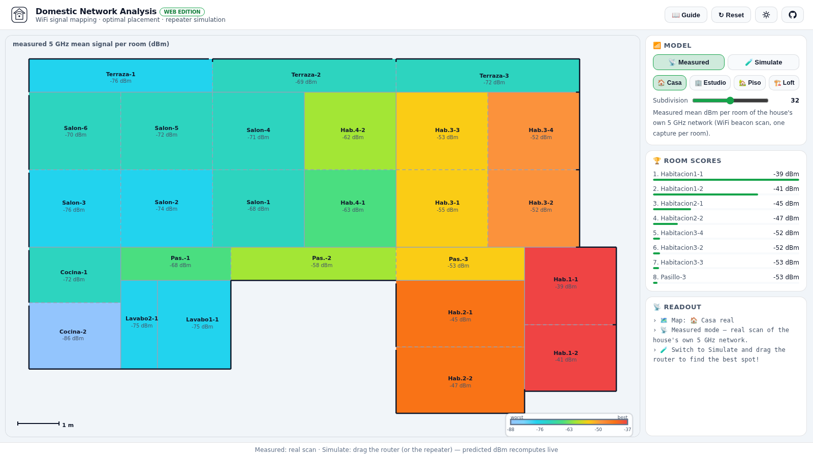
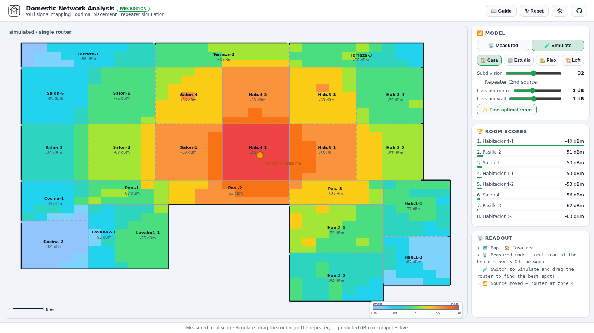
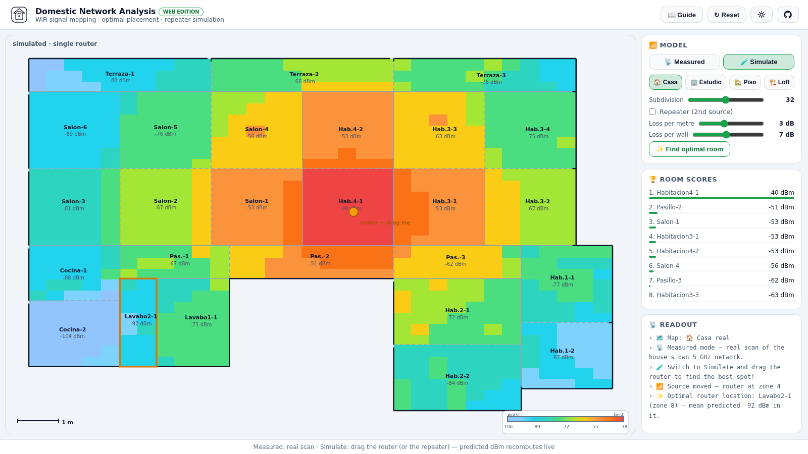

# 📶 Domestic Network Analysis (SCON 2020)

[](https://www.python.org/)
[](tests/)
[](https://alejp1998.github.io/domestic_net_analysis/)

> **▶️ Play it live:** <https://alejp1998.github.io/domestic_net_analysis/> — drag the router around your house plan and watch the predicted signal update live.

A complete analysis of a domestic WiFi network (Alejandro Jarabo-Peñas, SCON
2020): a **beacon scanner**, a **signal-strength study per room**, **band
occupancy** of 2.4/5 GHz, and two simulations — **optimal router placement**
and **WiFi repeater placement** — built on a path-loss model fitted from real
measurements.

## 📡 The pipeline

1. **`wifi_scanner.py`** — scapy-based monitor-mode scanner: hops channels
   1→14→36→60 and records every beacon (BSSID, SSID, zone/subzone, dBm,
   channel, crypto) into `data/scanned_networks.csv`.
2. **`DomesticNetworkAnalysis.ipynb`** — the full analysis:
   - choropleth of the measured 5 GHz signal per room (26 rooms, `house_zones.geojson`)
   - 2.4/5 GHz band occupancy & channel statistics
   - **WiFi placement simulation**: `dBm = dBm_max − (distance_m × 3 dB/m + walls × 7 dB/wall)`
     with a hand-built 10×10 zone wall matrix, scored by zone-weighted linear
     power → **the optimal room is Pasillo-2**
   - **repeater simulation**: same model with a second source, per-room gain

## 🧪 Model & tests

The model was extracted into **`analysis_model.py`** (reusable + unit-tested)
and ported to JavaScript for the web edition. The web simulator **refines the
notebook's zone-matrix walls with per-cell ray-cast wall counting** — every
heatmap cell walks the straight line from the router and counts the actual
walls crossed — **including the exterior walls** when the line leaves the
house through a concave corner or notch — and the travelled distance is split
into its **in-flat and out-of-flat parts, both charged in the distance
degradation** — so neighbouring rooms never lose to
more distant ones and corner rooms don't over-score. All distances are
converted to **real metres** with the geojson scale factor **×4.45**
(the original flat is ~120 m² — 14.2 × 10.4 m — so e.g. Salon-6 →
Habitacion2-2 is an 11.8 m line). A **scale bar** on every map shows the
real size at a glance. That
refinement is why the web edition's optimal spot can differ from the
notebook's Pasillo-2 result (the notebook's zone matrix is the coarser
approximation).

```bash
pip install -e ".[dev]"
pytest -q
ruff check .
```

- `load_rooms` merges the geojson floor plan with the measured means; the
  committed scan CSV is partial (no house-SSID rows), so the canonical
  per-room means from the executed notebook are used automatically.

### 🖼️ Screenshots

| Measured heatmap | Simulated mode in use | Optimal placement |
|---|---|---|
|  |  |  |

## 🎮 Interactive web edition

`webgame/` — an interactive floor-plan simulator:

- **🗺️ 4 flat plans** — the real scanned home (rebuilt as a perfectly tiled,
  gap-free plan whose **every wall sits exactly on the simulation cell grid**,
  so cells and rooms align 1:1) plus three designed flats: **Estudio**,
  **Piso 2 hab**, **Loft**
- **🔲 Discrete subdivision model** — a slider chooses the cell size; every
  cell predicts its own signal (distance to the router + ray-cast wall
  attenuation), so heatmaps are smooth and walls are grid-aligned and always
  meet
- **🧭 Zone groups** — rooms of the same functional area (the three Terraza,
  the six Salon, the Hab.3 block…) are outlined together: dashed lines mark
  the subroom divisions within a group, solid walls separate groups
- **📡 Measured** — the real scan heatmap per room
- **🧪 Simulate** — **drag the router** (and a **repeater**) anywhere; every
  cell's predicted dBm, the score ranking and the heatmap recompute live;
  tune the model's dB/metre and dB/wall sliders
- **✨ Find optimal room** — runs the exhaustive search over all rooms
- **🎨 Cold→hot scale** — −37 dBm (best) deep red → blue (worst), with dBm
  ticks on the legend

## 📁 Layout

```
wifi_scanner.py                beacon scanner (monitor mode)
analysis_model.py              extracted signal model + tests
DomesticNetworkAnalysis.ipynb  full analysis (executes end-to-end)
data/                          house_zones.geojson + scanned_networks.csv
webgame/                       interactive simulator + JS model port
tests/                         pytest suite
```
